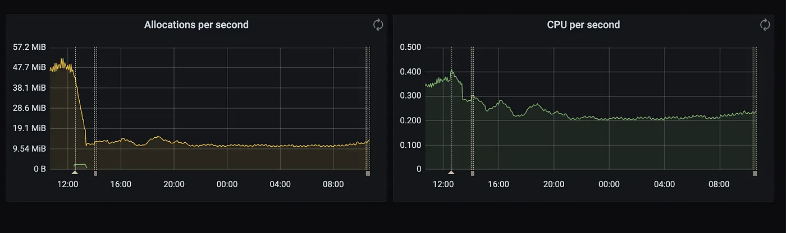

# Reducing metric cardinality in Prometheus

As it stands, we have 4 prometheis running in production that requires a significant amount of resources. This is leading to creation and management of high spec instances running in the cloud.

## 1. Identifying metrics with high cardinality
First goal is to identify what metrics are causing signficant strain on prometheus in terms of memory usage. These metrics are often associated with high cardinality (many unique dimensions) leading to prometheus storing a great amount of time series in the database.

### a) Prometheus TSDB API: Prometheus exposes an endpoint that displays cardinality statistics about the current head block. You’re able to gauge metrics such as highest time series count, unique label pairs and so forth.

Endpoint: <prometheus-url>/api/v1/tsdbstatus

After identifying labels with high value count, we can utilise prometheus api to view live values to get a glimpse of what data is being exposed.

using /v1/api/labels endpoint to see label pairs

### b) Upgrading docker image

We were running prometheus on tag v2.40.3 and the latest was v2.46.0 which meant we were only 6 minor versions behind. I decided it was worth checking the prometheus changelog to see if there were any changes that would provide us with a quick win.

store labels as string isntead of data structure
v2.44.0 includes https://github.com/prometheus/prometheus/pull/10991 which optimises the way label value pairs are stored by storing them via a string instead of using a separate data structure.

### c) Grafana mimirtool: https://github.com/grafana/mimir/tree/main/pkg/mimirtool

Grafanalabs developed an open source tool that allows you to identify unused metrics in Grafana and Prometheus. It achieves this by executing API calls to your grafana and prometheis instances. The tool covers a range of commands but we’ll only be utilising the following:

> **analyze grafana**
scans grafana instance for used metrics in dashboards and generates json artifact

> **analyze rule-file**
analyses prometheus rules and generates a json schema
analyze prometheus — scans prometheus instances check grafana and rule metrics against what is used in the instance.

For more information about additional commands, check out https://grafana.com/docs/mimir/latest/operators-guide/tools/mimirtool/

If you’re a Gopher or interested learning Go, go ahead and take a deep dive into the source code here: https://github.com/grafana/mimir/tree/main/pkg/mimirtool

## 2. Cleanup
By running mimirtool is generates a json artifact that provides us with valuable information related to total number of time series we are storing. As you can see it provides a additional_active_time_series value which showcases time series we’re storing but not using in dashboards or prometheus recording/alerting rules. Let’s try to dig deeper into what redundant metrics those point to.

> Total active/inactive time series being stored

Below we can see an attribute additional_metric_counts which shows us what metrics we’re storing in prometheus that we’re not utilising in rules or Grafana dashboards.

> redundant metrics

## Results
### Memory/CPU

> memory usage for prometheus instance 1

> cpu usage for prometheus instance 1

> per second memory/cpu allocations for prometheus

### Reduction in sample ingestion:

### Reduction in errors:

> Drop off in errors after prometheus changes in 07/25

Future work:
- Being able to intercept metrics with high cardinality during CI phase using https://github.com/cloudflare/pint
- Creating a dashboard that covers high cardinality
- Adding sample/label limits by default based on application priority
